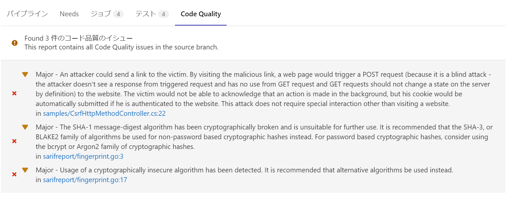

# SARIF Converter
Convert report from SARIF to other format reports.

* [GitLab CodeQuality](https://docs.gitlab.com/ee/ci/testing/code_quality.html#implementing-a-custom-tool)
* [GitLab SAST](https://gitlab.com/gitlab-org/security-products/security-report-schemas/-/blob/master/dist/sast-report-format.json?_gl=1%2a1guihbz%2a_ga%2aOTc1NjM2NDI3LjE2NjY3MDc4NzI.%2a_ga_ENFH3X7M5Y%2aMTY2OTcwMjI3MC45LjEuMTY2OTcwMjMxMC4wLjAuMA..)
* HTML (powered by [SARIF Web Component](https://github.com/microsoft/sarif-web-component))


## Supported Static Analyzer Tools
* [Semgrep](https://semgrep.dev/) - Static Code Scanning & Analysis Tool
* [GitLab Semgrep analyzer](https://gitlab.com/gitlab-org/security-products/analyzers/semgrep)
* [InspectCode Command-Line Tool](https://www.jetbrains.com/help/resharper/InspectCode.html#understanding-output) - static analyzer for .NET, powered by ReSharper
* [Security Code Scan](https://security-code-scan.github.io/) - static code analyzer for .NET
* [ESLint](https://eslint.org/) - Used together with [SARIF formatter for ESLint](https://www.npmjs.com/package/@microsoft/eslint-formatter-sarif)
* [ktlint](https://pinterest.github.io/ktlint/) - Kotlin linter
* [BinSkim Binary Analyzer](https://github.com/microsoft/binskim) - Portable Executable (PE) light-weight scanner


## Usage
Linux only!

```
$ sarif-converter --help
Usage:
  sarif-converter [OPTIONS] input1.sarif [input2.sarif...] output.json

Application Options:
  -v, --version                      Show version.
  -t, --type=[sast|codequality|html] Output report type. (default: html)
  -r, --src-root=                    Source root path.

Help Options:
  -h, --help                         Show this help message
```


### Install
```shell
$ wget -O sarif-converter https://gitlab.com/ignis-build/sarif-converter/-/releases/permalink/latest/downloads/bin/sarif-converter-linux
$ chmod +x sarif-converter
```


### Run
Run a static analysis tool such as [Semgrep](https://semgrep.dev/).

```shell
$ semgrep --config=auto --sarif --output=semgrep.sarif .
```

Convert to GitLab Code Quality json.

```shell
$ ./sarif-converter --type codequality semgrep.sarif gl-code-quality-report.json
```

Conver to GitLab SAST json.

```
$ ./sarif-converter --type sast semgrep.sarif gl-sast-report.json
```

Convert to html report.

```
$ ./sarif-converter --type html semgrep.sarif semgrp-report.html
```


#### Security Code Scan
[Install Security Code Scan](https://security-code-scan.github.io/#Installation) into your .NET project.

```shell
$ dotnet new tool-manifest
$ dotnet tool install security-scan
```

Scan your project.

```shell
$ dotnet security-scan YourProject.sln --export=security-scan.sarif
```

Convert to GitLab CodeQuality report.

```shell
$ ./sarif-converter --type codequality --src-root . security-scan.sarif gl-code-quality-report.json
```

Security Code Scan sarif reports are output as absolute paths.
The `--src-root` argument converts them to relative paths as required by the Code Quality report.


### Run in GitLab CI
```yaml
codequality:sast:
  image: $CI_TEMPLATE_REGISTRY_HOST/security-products/semgrep:3
  before_script:
    - wget -O sarif-converter https://gitlab.com/ignis-build/sarif-converter/-/releases/permalink/latest/downloads/bin/sarif-converter-linux
    - chmod +x sarif-converter
  script:
    - /analyzer run
    - ./sarif-converter --type codequality semgrep.sarif gl-code-quality-report.json
  artifacts:
    reports:
      codequality: gl-code-quality-report.json
```




## Warning
* `sast` - If `start_time` and etc is not provided in the SARIF file, ad hoc values are set.


## License
MIT
